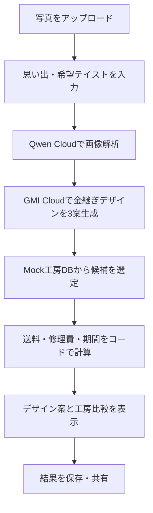
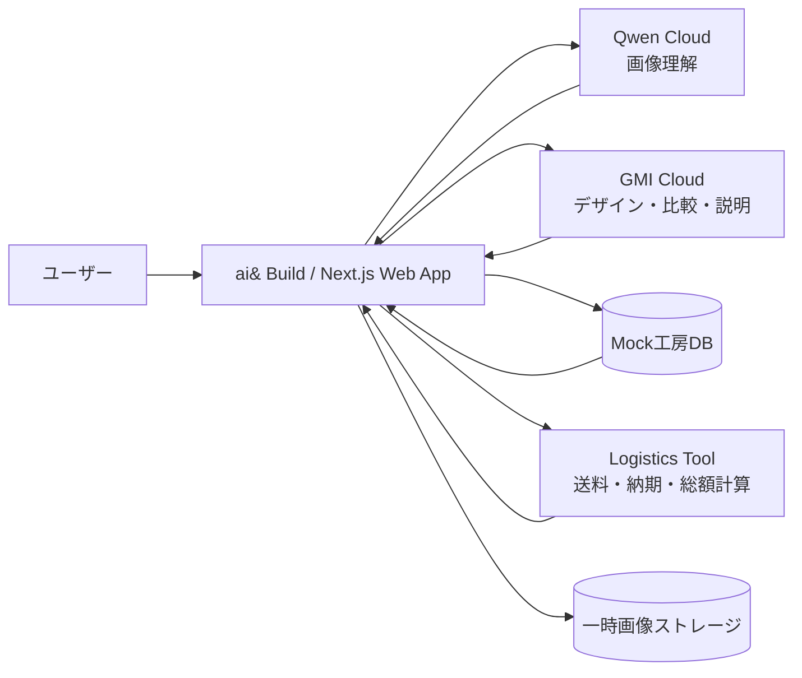

# KINTSUGI Design Agent

> 壊れた品の物語から、金継ぎデザインと修復先を提案するAI

- **文書:** ハッカソン向け システム設計書
- **Version:** 1.0
- **作成日:** 2026年7月25日
- **想定構成:** ai& Build × Qwen Cloud × GMI Cloud

# 0. エグゼクティブサマリー

本プロダクトは、壊れた食器や思い出の品の写真とストーリーを入力すると、**金継ぎデザイン案・適した工房・概算費用・完成までの期間**を一度に提示するAIサービスである。

### 設計方針

> 画像理解はQwen Cloud、複数モデルによる提案・比較・説明はGMI Cloud、送料・納期・総額はアプリ側の決定論的ロジックで算出する。Webアプリはai& Buildへデプロイする。

## 今回のMVPで実現すること

- 壊れた品の写真を1枚アップロードし、素材・色・破損状態を構造化する。

- 思い出や好みを反映した金継ぎデザインを3案提案する。

- Mockの工房データから、相性・価格・納期で候補を比較する。

- 住所地域と品物サイズから、往復送料と完成目安を概算する。

- 結果を1画面にまとめ、デモとして共有できる状態まで公開する。

## 今回やらないこと

- 実在工房への自動予約・決済・配送伝票発行

- 正確な修理可否や料金の保証

- 食品安全性や文化財修復に関する専門判断

- ユーザー住所からの厳密な経路探索・リアルタイム運賃取得

# 1. プロダクトコンセプト

## 1.1 解決したい課題

| **対象** | **課題**                         | **提供価値**                     |
|----------|----------------------------------|----------------------------------|
| ユーザー | どの工房に頼めばよいか分からない | 条件を比較して候補を提示         |
| ユーザー | 完成後の見た目を想像できない     | 物語に合わせたデザイン案を可視化 |
| ユーザー | 送料・期間を含む総額が分からない | 往復送料と修理日数を概算         |
| 工房     | 問い合わせ時の情報が不足する     | 写真・破損状態・希望を構造化     |

## 1.2 想定ユーザー

- 欠けたり割れたりした器を捨てずに残したい人

- 家族や旅行の思い出がある品を、物語ごと修復したい人

- 金継ぎに興味はあるが、工房選びや費用感が分からない人

## 1.3 価値提案

### 一言で表すと

> 「修理の見積もりサイト」ではなく、思い出を金継ぎの表現へ変換し、実現可能な工房までつなぐデザインコンシェルジュ。

# 2. ユーザーフロー



## 2.1 主要入力項目

| **項目**     | **内容**                                   | **MVP** |
|--------------|--------------------------------------------|---------|
| 写真         | 器または思い出の品の全体・破損箇所         | 必須    |
| ストーリー   | 誰から受け取ったか、思い出、残したい意味   | 任意    |
| 希望テイスト | 伝統的／ミニマル／大胆／植物・風景モチーフ | 任意    |
| 受取地域     | 都道府県または地方区分                     | 必須    |
| 優先条件     | 価格／速さ／デザイン相性                   | 必須    |

# 3. システム構成



## 3.1 サービスごとの役割

| **構成要素**         | **担当**                                   | **実装**          |
|----------------------|--------------------------------------------|-------------------|
| ai& Build            | Webアプリ、API、エージェント制御、公開URL  | デプロイ基盤      |
| Qwen Cloud           | 画像理解、破損状態・素材・色・形状のJSON化 | Visionモデル      |
| GMI Cloud            | デザイン案、工房比較、理由説明、モデル切替 | OpenAI互換推論API |
| アプリ内Mockロジック | 送料・納期・総額の計算                     | TypeScript関数    |
| Mock工房DB           | 工房プロフィール、価格、得意技法、対応地域 | JSONまたはSQLite  |

### 重要

> GMI Cloudそのものが配送費や工房へのアクセス情報を保有するわけではない。エージェントがアプリ側のMockデータと計算ツールを呼び出し、その結果を比較・説明する。

## 3.2 ハッカソン向け技術スタック

| **領域**       | **採用案**                                                   |
|----------------|--------------------------------------------------------------|
| Frontend / API | Next.js 15 App Router + Route Handlers                       |
| Language       | TypeScript                                                   |
| UI             | Tailwind CSS                                                 |
| AI SDK         | OpenAI互換クライアントをQwen/GMIで共通化                     |
| Data           | JSONファイル（工房・送料表・修理ルール）                     |
| Image Storage  | 一時URLまたはai&の利用可能なストレージ。未対応時はR2等へ退避 |
| Deploy         | ai& Build                                                    |

# 4. AIエージェント設計

## 4.1 オーケストレーション

1. Image Analyzer：Qwenへ画像を送り、破損状態を構造化する。

2. Design Agent：分析結果とストーリーから3つのデザインコンセプトを生成する。

3. Workshop Matcher：Mock工房データをスコアリングし、候補を3件選ぶ。

4. Logistics Tool：決定論的な関数で送料・期間・総額を算出する。

5. Recommendation Agent：比較結果をユーザー向けに分かりやすく説明する。

## 4.2 Qwen画像解析の出力形式

```json
{
"objectType": "ceramic_bowl",
"material": "ceramic",
"dominantColors": ["white", "blue"],
"damageType": "crack_and_chip",
"damageSeverity": "medium",
"crackCount": 2,
"missingAreaRatio": 0.04,
"visualMotifs": ["blue floral pattern"],
"repairNotes": ["曲面のため位置合わせに注意"],
"confidence": 0.82
}
```

## 4.3 GMI Cloudで使い分けるエージェント

| **エージェント** | **モデル特性**           | **責務**                                        |
|------------------|--------------------------|-------------------------------------------------|
| Design Agent     | 創造性重視モデル         | 物語と破損線から3案のテーマ・色・金属表現を作成 |
| Matcher Agent    | 推論・指示追従重視モデル | 工房データとの適合性を比較                      |
| Copy Agent       | 軽量・高速モデル         | 結果カードの短い説明文を生成                    |

## 4.4 LLMとロジックの境界

| **区分**       | **内容**                                           |
|----------------|----------------------------------------------------|
| LLMに任せる    | デザイン発想、物語の解釈、相性の理由、自然言語説明 |
| コードで計算   | 送料、配送日数、修理期間、合計金額、スコア集計     |
| 人間確認が必要 | 修理可能性、最終見積もり、食品利用可否、実際の納期 |

# 5. Mockデータ・概算ロジック

## 5.1 工房データ例

| **名称**   | **地域** | **タイプ**         | **基本料金** | **修理目安** | **得意分野**       |
|------------|----------|--------------------|--------------|--------------|--------------------|
| 工房A 東京 | 関東     | 伝統金継ぎ         | 8,000円      | 30日         | 白磁・青磁         |
| 工房B 京都 | 関西     | 意匠性の高い金継ぎ | 12,000円     | 45日         | 物語性・装飾       |
| 工房C 福岡 | 九州     | 簡易金継ぎ・短納期 | 6,000円      | 14日         | 日用品・小さな欠け |

## 5.2 送料Mock

| **区分（片道）** | **送料** | **配送日数** |
|------------------|----------|--------------|
| 同一地方         | 900円    | 1日          |
| 隣接地方         | 1,200円  | 2日          |
| その他           | 1,600円  | 2〜3日       |
| 北海道・沖縄     | 2,200円  | 3日          |

## 5.3 計算式

| **指標** | **計算**                                              |
|----------|-------------------------------------------------------|
| 往復送料 | 片道送料 × 2 + 梱包オプション                         |
| 修理料金 | 基本料金 + 破損度加算 + デザイン加算                  |
| 総額     | 修理料金 + 往復送料                                   |
| 完成目安 | 往路配送日数 + 工房待機日数 + 修理日数 + 復路配送日数 |

## 5.4 工房ランキング

**総合スコア ＝ デザイン相性 50% + 価格 25% + 納期 20% + 距離 5%**

- ユーザーが「価格優先」「速さ優先」を選んだ場合は重みを変更する。

- LLMはスコアを生成せず、計算済みスコアの理由を説明する。

# 6. 機能要件

## 6.1 画面一覧

| **No.** | **画面**             | **主要機能**                      |
|---------|----------------------|-----------------------------------|
| 01      | トップ／アップロード | 写真選択、利用上の注意            |
| 02      | ストーリー入力       | 思い出、好み、住所地域、優先条件  |
| 03      | 解析中               | 進行状況を段階表示                |
| 04      | デザイン提案         | 3案の名称、説明、金継ぎ線の方向性 |
| 05      | 工房比較             | 料金、送料、期間、相性スコア      |
| 06      | プロジェクト結果     | 選択内容の保存・共有              |

## 6.2 API一覧

| **Method** | **Endpoint**         | **責務**                   |
|------------|----------------------|----------------------------|
| POST       | /api/analyze         | 画像をQwenで解析           |
| POST       | /api/designs         | GMIでデザイン案を生成      |
| POST       | /api/recommendations | 工房候補とランキングを生成 |
| POST       | /api/estimate        | 送料・総額・期間を計算     |
| POST       | /api/projects        | 結果を保存（任意）         |

## 6.3 エラー時のフォールバック

- Qwen失敗：ユーザーに破損タイプを選択してもらい、Mock分析へ切り替える。

- GMI失敗：事前定義した3つのデザインテンプレートを返す。

- 画像保存失敗：ブラウザ内プレビューのみでデモを継続する。

- 工房データ不足：全工房を表示し、価格・納期のみで並べ替える。

# 7. データ設計

| **Entity**     | **主要フィールド**                                             |
|----------------|----------------------------------------------------------------|
| Project        | id, status, story, preference, region, priority                |
| Artifact       | imageUrl, objectType, material, colors                         |
| DamageAnalysis | damageType, severity, crackCount, missingAreaRatio, confidence |
| DesignOption   | title, concept, lineStyle, metalColor, rationale, previewUrl   |
| Workshop       | name, region, skills, basePrice, repairDays, styleTags         |
| Estimate       | repairFee, shippingFee, totalFee, totalDays, score             |

## 7.1 状態遷移

**DRAFT → ANALYZING → DESIGNING → ESTIMATING → COMPLETED**

- 各段階の結果を保存すると、外部API失敗時にも途中から再実行しやすい。

# 8. 非機能・安全設計

| **観点**     | **方針**                                                               |
|--------------|------------------------------------------------------------------------|
| 性能         | デモでは60秒以内を目標。解析中は段階表示する。                         |
| 可用性       | AI API失敗時のMockフォールバックを用意する。                           |
| プライバシー | 住所は都道府県まで。写真の長期保存はデフォルトで行わない。             |
| APIキー      | サーバー側環境変数で管理し、ブラウザへ露出させない。                   |
| 説明責任     | 金額・期間は「概算」、修復可否は「工房確認が必要」と表示する。         |
| 文化的配慮   | 金継ぎを単なる金色の装飾として扱わず、本漆・簡易修復の違いを明示する。 |

### 免責表示案

> AIによるデザインと費用・期間は参考情報です。実際の修理可否、食品利用の安全性、料金、納期は工房による現物確認後に確定します。

# 9. ハッカソン実装計画

| **時間** | **作業**                                            |
|----------|-----------------------------------------------------|
| 0〜2時間 | 画面骨格、Mock工房・送料データ、アップロードUI      |
| 2〜4時間 | Qwen画像解析、JSONスキーマ、結果確認                |
| 4〜6時間 | GMIデザインエージェント、工房マッチング             |
| 6〜7時間 | 送料・納期計算、結果画面の統合                      |
| 7〜8時間 | ai& Buildへデプロイ、失敗時フォールバック、デモ調整 |

## 9.1 実装優先順位

- P0：アップロード → 画像解析 → デザイン3案 → 工房比較 → 概算表示

- P1：金継ぎ線を重ねた簡易プレビュー画像

- P2：プロジェクト共有URL、多言語、実在工房API、決済

## 9.2 デモシナリオ

1. 祖母から受け継いだ青い茶碗の写真をアップロードする。

2. 「思い出を残しつつ、派手すぎない桜の枝のような線」を入力する。

3. AIが「静かな継承」「桜の記憶」「大胆な景色」の3案を提示する。

4. 東京・京都・福岡のMock工房について、総額と完成目安を比較する。

5. 価格優先からデザイン優先へ切り替え、推薦順位が変わることを見せる。

# 10. 完了条件（Acceptance Criteria）

| **ID** | **条件**                                        |
|--------|-------------------------------------------------|
| AC-01  | JPEG/PNGを1枚アップロードできる                 |
| AC-02  | 画像解析結果が構造化JSONとして取得できる        |
| AC-03  | 内容が異なるデザイン案を3件表示できる           |
| AC-04  | 工房候補を3件、料金・期間・理由付きで表示できる |
| AC-05  | 往復送料、総額、完成目安がコードで計算される    |
| AC-06  | AI APIが失敗してもMock結果でデモを継続できる    |
| AC-07  | ai& Build上の公開URLから操作できる              |

# 11. リスクと未決事項

| **リスク**         | **対応**                                                         | **重要度** |
|--------------------|------------------------------------------------------------------|------------|
| ai& Buildの仕様    | 利用可能ランタイム、ストレージ、環境変数、デプロイ手順を当日確認 | 高         |
| Qwen APIのモデル名 | 当日付与されるクレジット対象モデルに合わせる                     | 中         |
| 画像編集の品質     | P1扱い。難しい場合はデザイン説明と線のSVGオーバーレイで代替      | 中         |
| 工房データの正確性 | 今回は架空データであることを明示                                 | 低         |
| 実物の修理可否     | AIでは断定せず、工房確認を必須とする                             | 高         |

# 12. 将来拡張

- Google Maps等による工房までの経路・持ち込み時間の算出

- 配送会社APIまたは料金表による実送料・集荷予約

- 実在工房の空き状況、対応可能素材、修理事例とのマッチング

- 生成画像と実際の仕上がり事例を使った推薦精度向上

- 英語・中国語・韓国語対応によるインバウンド利用

- 修復前後の写真と物語を保存するデジタル証明書

## 12.1 当日確認チェックリスト

- ai& Buildで利用できるNode.jsランタイム、環境変数、ストレージを確認する。

- Qwen Cloudの対象モデル名、画像入力形式、レート制限を確認する。

- GMI Cloudの利用可能モデルとAPI Base URLを確認する。

- Mockモードへ切り替える環境変数（DEMO_MODE=true）を用意する。

- デモ用の器画像を2種類以上、事前にローカルへ保存する。

# 参考資料・前提

**\[1\] ai& 公式サイト：**Buildがアプリ、エージェント、プロダクトを本番へデプロイできる旨を確認。<https://www.aiand.com/>

**[2] GMI Cloud Documentation：**Inference APIがOpenAI互換である旨を確認。<https://docs.gmicloud.ai/>

**[3] Alibaba Cloud Model Studio - Visual understanding：**Qwenの画像・動画理解モデルと機能を確認。<https://help.aliyun.com/en/model-studio/vision-model/>

**[4] Alibaba Cloud Model Studio - OpenAI-compatible Vision：**Qwen Vision APIのOpenAI互換インターフェースを確認。<https://help.aliyun.com/en/model-studio/qwen-vl-compatible-with-openai>

### 前提

> 本設計は2026年7月25日時点の公開情報とハッカソン向け説明を基にしたMVP案である。利用可能なモデル、クレジット範囲、デプロイ機能は当日の案内を優先する。
